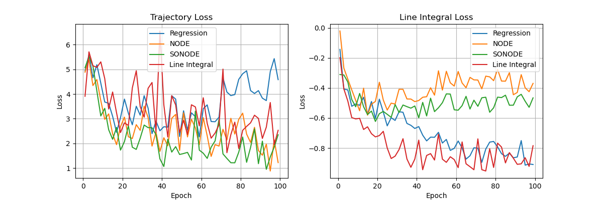
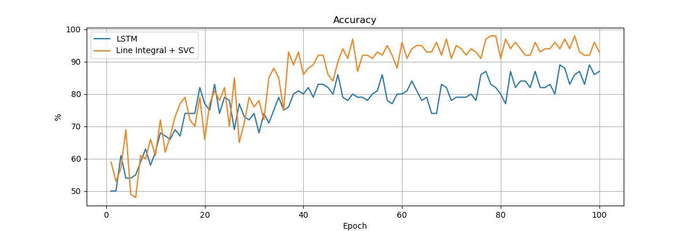

# Learning Ordinary Differential Equations with the Line Integral Loss Function

Contains a PyTorch implementation for the two experiments.
Also requires the [torchdiffeq](https://github.com/rtqichen/torchdiffeq) package to run.

## Learning Dynamical Systems

Train four neural networks to learn the dynamics of a double pendulum system.
The code generates the following plot:

 
 
Testing loss values for all models.

### Instructions:

Run the four model training scripts separately:

* `python regression.py`
* `python node.py`
* `python sonode.py`
* `python line_integral.py`

Each of these scripts writes a txt file containing the losses.

Then run the plotting script to generate the figure above:

* `python loss_plot.py`

## Motion Classification

Train two different classifiers to learn to classify time-series originating from two different types of double pendulums.
The code generates the following plot:

 
 
Classification accuracy.

### Instructions:

Run the two scripts separately:

* `python classifier_lstm.py`
* `python classifier_line_integral.py`

Each of these scripts writes a txt file containing the accuracies.

Then run the plotting script to generate the figure above:

* `python acc_plot.py`
